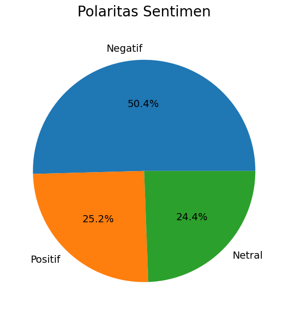
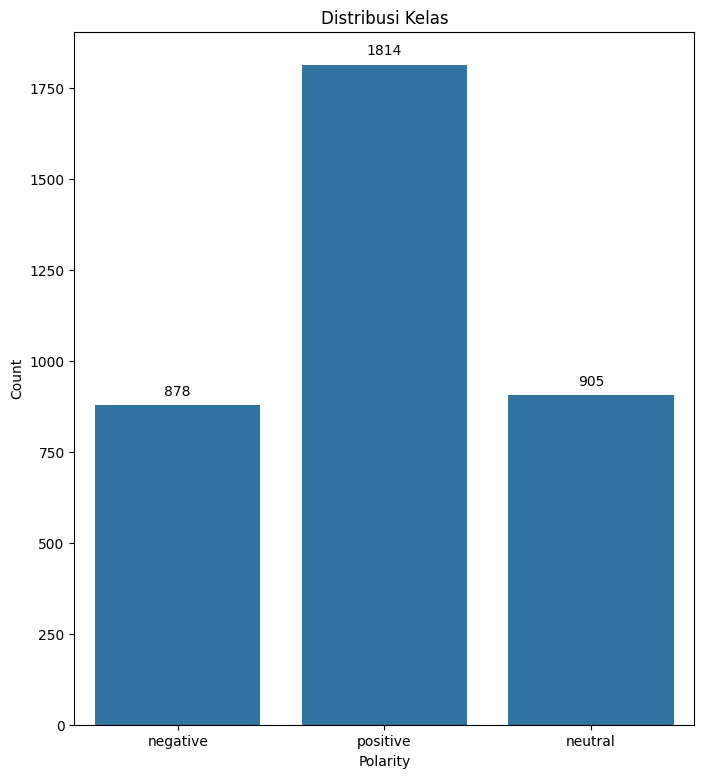

# Analisis Sentimen Ulasan Aplikasi Money Manager Menggunakan Support Vector Machine (SVM)
 
## Deskripsi Proyek
 
Proyek ini merupakan implementasi sistem **Analisis Sentimen** berbasis *Machine Learning* untuk mengklasifikasikan ulasan pengguna aplikasi **Money Manager Expense & Budgeting** di Google Play Store ke dalam tiga kategori sentimen: **Positif**, **Negatif**, dan **Netral**.
 
Proyek ini menggunakan algoritma **Support Vector Machine (SVM)** dengan kernel *linear* dan metode ekstraksi fitur **TF-IDF Vectorizer**, serta proses pelabelan otomatis berbasis **Lexicon Based** untuk membangun dataset ground-truth.
 
---
 
## Identitas Pembuat
 
| Atribut | Detail |
|---|---|
| **Nama** | Adrian Dwi Fahrezi Rizki |
| **Program Studi** | Teknik Informatika |
| **Institusi** | Jakarta Global University (JGU) |
| **Email** | adriandwifahrezirizki@gmail.com |
| **LinkedIn** | [adrian-dwi-fahrezi-rizki](https://linkedin.com/in/adrian-dwi-fahrezi-rizki) |
 
---
 
## Struktur Proyek
 
```
Sentimen-Analisis-Money-Manager/
│
├── datasets/
│   └── hasil_scraping_moneymanager.csv   # Dataset hasil web scraping (3.597 ulasan)
│
├── models/
│   ├── svm_model.pkl                     # Model SVM terlatih (tersimpan)
│   └── tfidf_vectorizer.pkl              # TF-IDF Vectorizer terlatih (tersimpan)
│
├── notebooks/
│   ├── 1_Scraping_Data_Sentimen_Analisis.ipynb    # Tahap 1: Pengambilan data
│   ├── 2_Pemodelan_Sentimen_Analisis.ipynb        # Tahap 2: Preprocessing, Training & Evaluasi
│   └── 3_Testing_Sentimen_Analisis.ipynb          # Tahap 3: Uji prediksi teks baru
│
├── assets/
│   ├── PIE_CHART.png                     # Distribusi polaritas sentimen
│   ├── Diagram.png                       # Bar chart distribusi kelas
│   ├── Word_Cloud_Positive.jpg           # Word cloud ulasan positif
│   ├── Word_Cloud_Negative.jpg           # Word cloud ulasan negatif
│   └── Poster_Penelitian_Adrian.pdf      # Poster penelitian akademik
│
├── requirements.txt                      # Daftar dependensi Python
└── README.md                             # Dokumentasi proyek ini
```
 
---
 
## Alur Kerja (Workflow)
 
```
Web Scraping
    ↓
Text Preprocessing
(Cleaning → Case Folding → Tokenizing → Stopword Removal → Stemming)
    ↓
Pelabelan Otomatis (Lexicon Based)
    ↓
Feature Extraction (TF-IDF)
    ↓
Split Data (80% Train / 20% Test)
    ↓
Training Model SVM (Kernel Linear)
    ↓
Evaluasi (Confusion Matrix, Accuracy, Precision, Recall, F1-Score)
    ↓
Simpan Model (.pkl)
```
 
### Penjelasan Tiap Tahap
 
| # | Tahap | Keterangan |
|---|---|---|
| 1 | **Web Scraping** | Pengambilan data ulasan dari Google Play Store menggunakan `google-play-scraper` |
| 2 | **Cleaning** | Menghapus karakter spesial, emoji, URL, angka, dan tanda baca |
| 3 | **Case Folding** | Mengubah seluruh teks menjadi huruf kecil (*lowercase*) |
| 4 | **Tokenizing** | Memecah kalimat menjadi token/kata individual |
| 5 | **Normalisasi** | Mengganti kata tidak baku menjadi kata baku (kamus normalisasi) |
| 6 | **Stopword Removal** | Menghapus kata-kata umum yang tidak bermakna (menggunakan NLTK + kustom) |
| 7 | **Stemming** | Mengubah kata berimbuhan ke bentuk dasar menggunakan **Sastrawi** |
| 8 | **Lexicon Labeling** | Pelabelan sentimen otomatis berbasis kamus leksikon (Positif/Negatif/Netral) |
| 9 | **TF-IDF** | Pembobotan fitur kata berdasarkan frekuensi dan keunikannya |
| 10 | **SVM Training** | Melatih model klasifikasi menggunakan SVM kernel linear |
| 11 | **Evaluasi** | Mengukur performa model menggunakan Confusion Matrix |
 
---
 
## Dataset
 
| Atribut | Detail |
|---|---|
| **Sumber Data** | Google Play Store — Money Manager Expense & Budgeting |
| **Metode Pengumpulan** | Web Scraping (`google-play-scraper`) |
| **Bahasa** | Indonesia |
| **Total Ulasan** | **3.597 ulasan** |
| **File** | `datasets/hasil_scraping_moneymanager.csv` |
 
### Distribusi Kelas
 
| Sentimen | Jumlah Ulasan | Persentase |
|---|---|---|
| ✅ Positif | 1.814 | 50,4% |
| ⚪ Netral | 905 | 25,2% |
| ❌ Negatif | 878 | 24,4% |
| **Total** | **3.597** | **100%** |
 
---
 
## Hasil Evaluasi Model
 
Model SVM kernel linear dilatih dengan split data **80% training / 20% testing** dan menghasilkan metrik evaluasi sebagai berikut:
 
### Classification Report
 
| Kelas | Precision | Recall | F1-Score | Support |
|---|---|---|---|---|
| Negatif | 0.91 | 0.54 | 0.67 | 878 |
| Netral | 0.77 | 0.95 | 0.85 | 905 |
| Positif | 0.88 | 0.96 | 0.92 | 1.814 |
| **Accuracy** | — | — | **0.87** | **3.597** |
 
> **Akurasi model: 87%**
 
### Analisis Hasil
 
- **Kelas Positif** memperoleh F1-Score tertinggi **(0.92)**, menunjukkan model paling efektif mengenali ulasan positif.
- **Kelas Netral** memiliki Recall tinggi (0.95) namun Precision lebih rendah (0.77), menandakan beberapa ulasan negatif/positif ikut terklasifikasi sebagai netral.
- **Kelas Negatif** memiliki Recall terendah (0.54), menunjukkan model masih kesulitan mendeteksi seluruh ulasan bernada keluhan — hal ini wajar karena banyak ulasan negatif tetap mengandung kata-kata positif.
---
 
## Visualisasi Data

**Distribusi Sentimen (Pie Chart)**



**Distribusi Kelas (Bar Chart)**



**Word Cloud Ulasan Positif**


**Word Cloud Ulasan Negatif**


 
> Kata dominan negatif: *pengeluaran, iklan, hilang, susah, data, error, laporan, uang*
 
---
 
## Teknologi & Library
 
| Library | Fungsi |
|---|---|
| `python` | Bahasa pemrograman utama |
| `scikit-learn` | SVM, TF-IDF, evaluasi model |
| `pandas` | Manipulasi dan analisis data tabular |
| `numpy` | Komputasi numerik |
| `nltk` | Tokenisasi dan stopword removal |
| `PySastrawi` | Stemming Bahasa Indonesia |
| `google-play-scraper` | Web scraping ulasan Google Play Store |
| `matplotlib` / `seaborn` | Visualisasi data (chart, diagram) |
| `wordcloud` | Visualisasi frekuensi kata |
| `pickle` | Penyimpanan dan loading model `.pkl` |
 
---
 
## Cara Menjalankan Proyek
 
### 1. Clone Repositori
 
```bash
git clone https://github.com/username-kamu/Sentimen-Analisis-Money-Manager.git
cd Sentimen-Analisis-Money-Manager
```
 
### 2. Install Dependensi
 
```bash
pip install -r requirements.txt
```
 
### 3. Jalankan Notebook Secara Berurutan
 
| Urutan | File Notebook | Deskripsi |
|---|---|---|
| **1** | `1_Scraping_Data_Sentimen_Analisis.ipynb` | Scraping ulasan dari Google Play Store |
| **2** | `2_Pemodelan_Sentimen_Analisis.ipynb` | Preprocessing, training SVM, dan evaluasi |
| **3** | `3_Testing_Sentimen_Analisis.ipynb` | Prediksi sentimen pada teks baru |
 
> **Catatan:** Notebook dirancang untuk dijalankan di **Google Colab**. Jika menjalankan secara lokal, pastikan semua library di `requirements.txt` sudah terpasang.
 
### 4. Menggunakan Model yang Sudah Dilatih
 
Jika ingin langsung menggunakan model tanpa melatih ulang, gunakan file `.pkl` di folder `models/`:
 
```python
import pickle
 
# Load model dan vectorizer
with open('models/svm_model.pkl', 'rb') as f:
    svm_model = pickle.load(f)
 
with open('models/tfidf_vectorizer.pkl', 'rb') as f:
    tfidf = pickle.load(f)
 
# Prediksi teks baru
teks_baru = ["Aplikasi ini sangat membantu saya mengatur keuangan harian"]
teks_tfidf = tfidf.transform(teks_baru)
prediksi = svm_model.predict(teks_tfidf)
 
print(f"Sentimen: {prediksi[0]}")  # Output: positive / negative / neutral
```
 
---
 
## Requirements
 
Buat file `requirements.txt` dengan isi berikut:
 
```
scikit-learn>=1.3.0
pandas>=2.0.0
numpy>=1.24.0
nltk>=3.8.1
PySastrawi>=1.2.0
google-play-scraper>=1.2.4
matplotlib>=3.7.0
seaborn>=0.12.0
wordcloud>=1.9.2
```
 
Install sekaligus:
 
```bash
pip install -r requirements.txt
```
 
---
 
## Catatan Tambahan
 
- Proses **Stemming** Bahasa Indonesia menggunakan library **PySastrawi** yang berbasis algoritma Enhanced Confix Stripping (ECS).
- **Lexicon Based** yang digunakan untuk pelabelan otomatis adalah kamus sentimen Bahasa Indonesia yang berisi daftar kata positif dan negatif.
- Model disimpan dalam format **pickle (`.pkl`)** sehingga dapat langsung digunakan ulang tanpa proses training ulang.
- Dataset hasil scraping tersedia di folder `datasets/` dan dapat digunakan kembali untuk eksperimen lebih lanjut.
---
 
## Saran Pengembangan
 
- [ ] Mencoba **kernel non-linear SVM** (RBF, Polynomial) untuk meningkatkan Recall kelas Negatif
- [ ] Mengimplementasikan **BERT** atau **IndoBERT** untuk representasi teks yang lebih kontekstual
- [ ] Menerapkan **SMOTE** atau teknik *oversampling* untuk menangani ketidakseimbangan kelas
- [ ] Membangun antarmuka web sederhana (Flask/Streamlit) untuk demo prediksi secara *real-time*
- [ ] Membandingkan performa SVM dengan **Naive Bayes**, **Random Forest**, dan **LSTM**
---
 
## Lisensi
 
Proyek ini dibuat untuk keperluan akademik dalam program Kampus Merdeka. Bebas digunakan untuk referensi dan pengembangan lebih lanjut dengan mencantumkan sumber.
 
---
 
<div align="center">
**Teknik Informatika · Jakarta Global University (JGU) · Kampus Merdeka · 2026**
 
</div>
 
